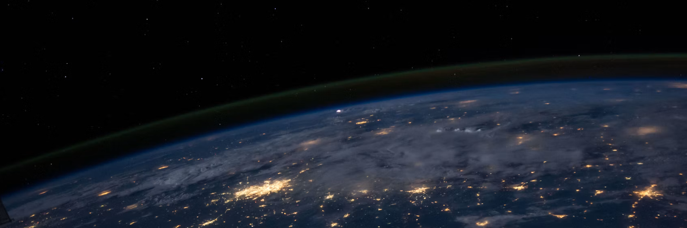

  

# 🌌 VR Demo: Space

A **Virtual Reality** project built in **Unreal Engine 5**. The project consists of two different interactive space demos showcasing environment design, lighting, and VR mechanics.

---

## 🎬 Video Demo

Click the images below to watch the demos on YouTube.

### 1. International Space Station (ISS) VR Demo
*A recreation of the interior environment of the ISS space station.*

### 2. Space Ship VR Demo
*An interactive demo inside a fantasy sci-fi spaceship.*

---

## 🚧 Future Development

The project will be updated with more technical documentation in the future. Planned additions include:

- **Blueprint images and explanations:** To showcase the logic behind the VR interactions.
- **Code examples (Blueprints):** Insights into how specific mechanics were implemented.
- **Architecture:** A description of how the project is structured in Unreal Engine 5.

*(The documentation will be updated as soon as the UE5 development environment is fully set up on my current Linux machine.)*
